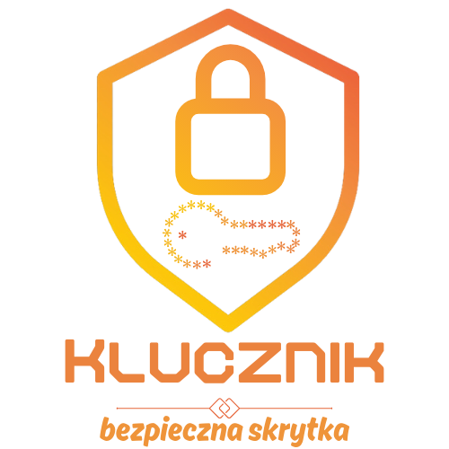

# Klucznik – Bezpieczna Skrytka



Klucznik to nowoczesny menedżer haseł, który łączy intuicyjny interfejs z zaawansowanymi technologiami zabezpieczeń. Naszym celem jest zapewnienie kompleksowej ochrony danych logowania w łatwy i przystępny sposób. Oferujemy m.in.:  
- **Bezpieczne szyfrowanie** za pomocą biblioteki Fernet.  
- **Dwuskładnikowe uwierzytelnianie (2FA)** oparte na TOTP.  
- **Wbudowany generator haseł** dla jeszcze większego bezpieczeństwa.  

---

## Funkcjonalności

### 🔒 Zaawansowane szyfrowanie danych
Klucznik wykorzystuje bibliotekę Fernet, zapewniając najwyższy poziom poufności i integralności danych. Wszystkie hasła są szyfrowane symetrycznie, co minimalizuje ryzyko ich przechwycenia.  

### ⚙️ Mechanizm dwuskładnikowego uwierzytelniania (2FA)
Aplikacja wspiera TOTP, co oznacza, że do logowania potrzebne są zarówno hasło, jak i jednorazowy kod generowany na podstawie czasu.  

### 🔧 Wbudowany generator haseł
Tworzenie silnych i unikalnych haseł nigdy nie było prostsze. Klucznik generuje losowe kombinacje znaków alfanumerycznych oraz specjalnych.  

### 🎨 Intuicyjny interfejs użytkownika
Nasza aplikacja jest zaprojektowana z myślą o prostocie i wygodzie. Zarządzanie hasłami nigdy nie było tak łatwe!  

---

## Instalacja

### 1. Pobierz aplikację
Już niedługo

### 2. Zainstaluj zależności
```bash
pip install -r requirements.txt
```

### 3. Uruchom aplikację
```bash
python main.py
```

---

## Zespół

- **Jakub Szczepański** :: Team Leader  
- **Dawid Mrówczyński** :: Backend Developer  
- **Wawrzyniec Waliczek** :: Database Specialist  
- **Radosław Witkowicz** :: Frontend Developer  

---

## Licencja
Projekt Klucznik jest udostępniony na licencji MIT. Zapraszamy do używania i wspierania naszego projektu!  

---

# Klucznik – Safe Vault

  

Klucznik is a modern password manager combining an intuitive interface with advanced security technologies. Our goal is to provide comprehensive protection for login credentials in an easy and accessible way. Features include:  
- **Secure encryption** using the Fernet library.  
- **Two-Factor Authentication (2FA)** based on TOTP.  
- **Built-in password generator** for enhanced security.  

---

## Features

### 🔒 Advanced Data Encryption
Klucznik leverages the Fernet library, ensuring the highest level of data confidentiality and integrity. All passwords are symmetrically encrypted, minimizing the risk of interception.  

### ⚙️ Two-Factor Authentication Mechanism (2FA)
The application supports TOTP, requiring both a password and a time-based one-time code for login.  

### 🔧 Built-in Password Generator
Creating strong and unique passwords has never been easier. Klucznik generates random combinations of alphanumeric and special characters.  

### 🎨 Intuitive User Interface
Designed with simplicity and convenience in mind, managing passwords has never been so effortless!  

---

## Installation

### 1. Download the application
Soon

### 2. Install dependencies
```bash
pip install -r requirements.txt
```

### 3. Run the application
```bash
python main.py
```

---

## Team

- **Jakub Szczepański** :: Team Leader  
- **Dawid Mrówczyński** :: Backend Developer  
- **Wawrzyniec Waliczek** :: Database Specialist  
- **Radosław Witkowicz** :: Frontend Developer  

---

## License
The Klucznik project is released under the MIT License. Feel free to use and contribute to our project!  

